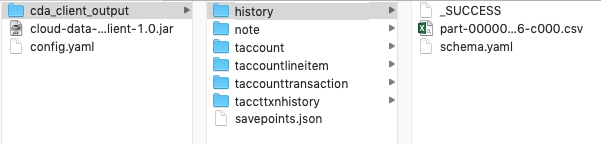

# Cloud Data Access Client

The Cloud Data Access Client (CDA Client) is a utility to download table data from an Amazon S3 bucket that has been populated by Guidewire's Cloud Data Access (CDA). The utility reads the .parquet files generated by CDA for each table, and can do one of the following:

- Convert them into human readable .csv files
- Transfer them as .parquet files
- Load the data into a common database platform: SQL Server, Oracle, PostgreSQL. 

The example code can be used to jump-start development of a custom implementation that can store CDA data in other storage formats (e.g., RDBMS Tables, Hadoop/Hive, JSON Files).
Learn more about CDA [here](https://https://docs.guidewire.com/cloud/cda/banff/index.html).

- - - 
# Overview of CDA Client

Click to expand

When converting to .csv files, the utility provides the schema for each table in a ``schema.yaml`` file, and can be configured to output the resultant files into a designated local filesystem location or another Amazon S3 bucket. When writing to a database, the data can be loaded in its raw format, with each activity recorded from the source system database, or it can be merged into tables that more closely resemble the source system database.

The utility also resumes downloading from the point which it last read up to when rerun, so that new data in the source bucket can be read efficiently and incrementally over multiple runs. 
### Code Structure

- Written in Scala
- Main program starts in gw.cda.api.CloudDataAccessClient
- Config, SavePoints, Manifest, TableReader, OutputWriter

- - -

## Build the CDA Client

Click to expand

1. Set up your IDE:
   - Use Java/JDK 8
   - Open project dir with IntelliJ
2. Download the CDA Client code.
3. Build by executing this command:
~~~~
./gradlew build
~~~~
4. **For Windows only, download additional utilities**: This utility uses Spark, which in turn uses Hadoop to interact with local filesystems. Hadoop requires an additional Windows library to function correctly with the Windows file system. 

   1. Create a `bin` folder in the folder that contains the CDA Client JAR file.
   2. Download the winutils.exe file for Hadoop 2.7 and place it in `bin` folder 
     (e.g., [winutils](https://github.com/cdarlint/winutils/tree/master/hadoop-2.7.7/bin)). 
   3. Download and install this Visual C++ Redistributable package: 
      - [Visual C++ 2010 Redistributable Package (x86)](http://www.microsoft.com/en-us/download/details.aspx?id=5555) if you're on a 32-bit machine
      - [Visual C++ 2010 Redistributable Package (x64)](http://www.microsoft.com/en-us/download/details.aspx?id=14632) if you're on a 64-bit machine.
   4. Before running the utility, set an additional environment variable named `HADOOP_HOME` to the system path to the folder which contains the "bin" folder that contains the winutils.exe executable.
For example, if the `winutils.exe` file is located at `C:\Users\myusername\Documents\cloud-data-access-client\bin\winutils.exe`, set the HADOOP_HOME variable as follows: 

~~~~
set HADOOP_HOME=C:\Users\myusername\Documents\cloud-data-access-client-demo
~~~~

For more info, see:
-  [Page at cwiki.apache.org](https://cwiki.apache.org/confluence/display/HADOOP2/WindowsProblems)
- [Page at answers.microsoft.com](https://answers.microsoft.com/en-us/insider/forum/insider_wintp-insider_repair/how-do-i-fix-this-error-msvcp100dll-is-missing/c167d686-044e-44ab-8e8f-968fac9525c5?auth=1)

- - - 
## Run the CDA Client

Click to expand

1. **Configure S3 authentication**: The utility requires AWS credentials to access the source S3 bucket that contains the table data (and optionally to write to a destination S3 bucket). These must be exported in the command line before running the program. For example, use this command after replacing `<secret key>`, `<access key>`, and `<region name>` with values from a user's credentials file located in `~/.aws/credentials`:
~~~~
export AWS_SECRET_ACCESS_KEY=<secret key> AWS_ACCESS_KEY_ID=<access key> AWS_REGION=<region name>
~~~~

   - If you are using awscli with a credentials file and profiles, you will need to use the environment var `AWS_PROFILE`, instead of setting the keys directly. For example:  
~~~~
export AWS_PROFILE=myProfile
~~~~
* More information can be found here for setting up [AWS Credentials](https://docs.aws.amazon.com/cli/latest/userguide/cli-chap-configure.html)

2. Download the sample configuration file from the Git repository folder `/src/test/resources/sample_config.yaml` and save under a new name such as `config.yaml`.
3. Configure the `config.yaml` file.
4. Run the utility by executing the jar from the command line with one of these commands:
  <ul><li>If you are running the CDA Client for the first time (without a <tt>savepoints.json</tt> file from a previous run) or have a large amount of data in the S3 bucket, both reading and writing can take a substantial amount of time depending on your machine. By default, the Java runtime environment [allocates a maximum of 1/4 of the computer's memory](https://docs.oracle.com/javase/8/docs/technotes/guides/vm/gc-ergonomics.html). It may be necessary to increase the memory available to the application for larger amounts of data. For example, run the client with an increased maximum memory allocation of 8 GB ("8g") with this command:

~~~~
java -Xmx8g -jar cloud-data-access-client-1.0.jar --configPath "config.yaml"
~~~~
</li>
<li>If you are downloading incremental changes, run the utility with this command, where the option <tt>--configPath</tt> or <tt>-c</tt> designates the path to the configuration file:

~~~~
java -jar cloud-data-access-client-1.0.jar --configPath "config.yaml"
~~~~
</li></ul>

- - -
### Tips

- NOTE: if tests fail due to a Spark error (something like a `BindException`),
  [see this link](https://stackoverflow.com/questions/34601554/mac-spark-shell-error-initializing-sparkcontext)
- For AWS credentials issues with Spark/Hadoop,
  [see this link](http://wrschneider.github.io/2019/02/02/spark-credentials-file.html)
- For using Scala test assertions,
  [see this link](http://www.scalatest.org/user_guide/using_matchers)

- - -
## Configuration Parameters

Click to expand

Configuration parameters are specified through a .yaml file (typically named config.yaml). 
   
 

Click to see the entire config.yaml file

 
Config parameters are structured in the file as such:

~~~~
sourceLocation:
  bucketName: ...
  manifestKey: ...
outputLocation:
  path: ...
savepointsLocation:
  path: ...
outputSettings:
  tablesToInclude: ...
  saveIntoJdbcRaw: ...
  saveIntoJdbcMerged: ...
  exportTarget: ...
  fileFormat: ...
  includeColumnNames: ...
  saveAsSingleFile: ...
  saveIntoTimestampDirectory: ...
jdbcConnectionRaw:
  jdbcUsername: ...
  jdbcPassword: ...
  jdbcUrl: ...
  jdbcSchema: ...
  jdbcSaveMode: ...  
jdbcConnectionMerged:
  jdbcUsername: ...
  jdbcPassword: ...
  jdbcUrl: ...
  jdbcSchema: ...
  jdbcApplyLastestUpdatesOnly: ...
performanceTuning:
  numberOfJobsInParallelMaxCount: ...
  numberOfThreadsPerJob: ...
sparkTuning:
  maxResultSize: ...
  driverMemory: ...
  executorMemory: ...
~~~~

<dl>

<dt><tt>sourceLocation</tt></dt>
<dd>Contains the following parameters about the location of the S3 bucket and the manifest.json file:
<dl><dt><tt>bucketName</tt></dt>
<dd>Name of the source S3 bucket to download data from.</dd>
<dt><tt>manifestKey</tt></dt>
<dd>Path to the manifest.json file in the source bucket, from which the utility reads information about each table. For example, <tt>CDA/manifest.json</tt>. By default, CDA creates the manifest.json file at the same level as table-specific folders in S3 bucket.</dd> </dl></dd>
<dt><tt>outputLocation</tt></dt>
<dd>
<dl>
<dt><tt>path</tt></dt>
<dd>Local file system directory to which the csv files will be written. The directory must exist in the local filesystem before the utility can write to it. To write the CSV's to a S3 bucket, simply replace the path with a valid s3 url (e.g. <tt>s3://example-bucket/cda_client_output</tt>). The utility uses the same AWS credentials for reading from the source bucket and for writing to the destination bucket.</dd>
</dl></dd>

<dt><tt>savepointsLocation</tt></dt>
<dd>
<dl><dt><tt>path</tt></dt>
<dd>Local filesystem directory where the savepoints.json file exists. For more information on this file, see the "Savepoints file" section below.</dd></dl></dd>

<dt><tt>outputSettings</tt></dt>
<dd>
<dl><dt><tt>tablesToInclude</tt></dt>
<dd>(Should be blank by default)</dd><dd> A comma delimited list of tables to include. Leave blank or omit to include all tables in the output.  This is for testing or troubleshooting purposes only. In a Production environment there should be no values here. It is for loading one or more tables to test connectivity, reviewing individual tables in a testing scenario.</dd>
<dt><tt>saveIntoJdbcRaw</tt></dt>
<dd>Boolean (defaults to false)</dd><dd>Should be "true" to write data to a database in Raw format (all activities and operations included in the output). </dd>
<dt><tt>saveIntoJdbcMerged</tt></dt>
<dd>boolean (defaults to false)</dd><dd>Should be "true" to write data to a database in Merged format (more closely representing the source system data). </dd>
<dt><tt>exportTarget</tt></dt>
<dd>(defaults to file)</dd><dd>Available export targets are <tt>file</tt> and <tt>jdbc</tt>.</dd>
<dt><tt>fileFormat</tt></dt>
<dd>(defaults to csv)</dd><dd>Available output formats are .csv and .parquet.</dd>
<dt><tt>includeColumnNames</tt></dt>
<dd>Boolean (defaults to false)</dd><dd>Should be "true" to include a row of column names at the top of the csv file for each table, and "false" for no header row.</dd>
<dt><tt>saveAsSingleFile</tt></dt>
<dd>Boolean (defaults to false)</dd><dd>Should be "true" for writing out a single file (.csv or .parquet) per table, and "false" to have multiple/smaller files be written based on SPARK partitioning.</dd>
<dt><tt>saveIntoTimestampDirectory</tt></dt>
<dd>Boolean (defaults to false)</dd><dd>Should be "true" to save the CSV files into a directory with savepoint timestamp (/outputLocation/path/table/timestamp/*.csv), and "false" to save directly into the table directory (/outputLocation/path/table/*.csv).</dd>
</dl></dd>

<dt><tt>jdbcConnectionRaw</tt></dt>
<dd>Optional section
<dl><dt><tt>jdbcUsername</tt></dt>
<dd>User name used to connect to the database. Can be a placeholder value if using windows authentication for database connectivity. </dd>
<dt><tt>jdbcPassword</tt></dt>
<dd>Password used to connect to the database. Can be a placeholder value if using windows authentication for database connectivity.  </dd>
<dt><tt>jdbcUrl</tt></dt>
<dd>Connection string for database connectivity. </dd>
<dt><tt>jdbcSchema</tt></dt>
<dd>Database schema owner designation for tables written to the database. i.e. - 'dbo' is the default for SQL Server, 'public' is the default for PostgreSQL.</dd>
<dt><tt>jdbcSaveMode</tt></dt>
<dd>(defaults to append)</dd><dd>Values <tt>overwrite</tt> or <tt>append</tt>. When saveIntoJdbcMerged is true, savemode is not relavant. </dd></dl></dd>

<dt><tt>jdbcConnectionMerged</tt></dt>
<dd>Optional section
<dl><dt><tt>jdbcUsername</tt></dt>
<dd>User name used to connect to the database. Can be a placeholder value if using windows authentication for database connectivity. </dd>
<dt><tt>jdbcPassword</tt></dt>
<dd>Password used to connect to the database. Can be a placeholder value if using windows authentication for database connectivity.  </dd>
<dt><tt>jdbcUrl</tt></dt>
<dd>Connection string for database connectivity. </dd>
<dt><tt>jdbcSchema</tt></dt>
<ddDdatabase schema owner designation for tables written to the database. i.e. - 'dbo' is the default for SQL Server, 'public' is the default for PostgreSQL.</dd>
<dt><tt>jdbcApplyLatestUpdatesOnly</tt></dt>
<dd>Boolean (defaults to false)</dd><dd>Should be "true" for applying the latest version of a record for a given table. "false" will process all the activities for a record in the order they occurred. for CDC processing, the most recent entry for a given record is the current state of that record. this option allows the application of only that most recent activity and version of the record.</dd>
</dl></dd>

<dt><tt>performanceTuning</tt></dt>
<dd>Optional section
<dl><dt><tt>numberOfJobsInParallelMaxCount</tt></dt>
<dd>Integer - defaults to the number of processors on your machine</dd><dd>Depending on your machine/network, you can go to about 2 times that to get more concurrency.</dd>
<dt><tt>numberOfThreadsPerJob</tt></dt>
<dd>integer - defaults to 10</dd><dd>This allows for parallel parquet file downloads while processing a given table.</dd></dl></dd>

<dt><tt>sparkTuning</tt></dt>
<dd>Optional section
<dl><dt><tt>maxResultSize</tt></dt>
<dd>See <a href="https://spark.apache.org/docs/latest/configuration.html#application-properties">spark.driver.maxResultSize</a>. The CDA client places no limit on this by default, so you usually don't have to touch it.</dd>
<dt><tt>driverMemory</tt></dt>
<dd>See <a href="https://spark.apache.org/docs/latest/configuration.html#application-properties">spark.driver.memory</a>. Set this to a large value for better performance.</dd>
<dt><tt>executorMemory</tt></dt>
<dd>See <a href="https://spark.apache.org/docs/latest/configuration.html#application-properties">spark.executor.memory</a>.</dd>
</dl></dd>
</dl>

`Warning: Boolean parameters default to "false" if they are not set.`

- - - 
## More about outputs
### Savepoints file

Click to expand

The CDA Client creates a savepoints.json file to keep track of the last batch of table data which the utility has successfully read and written. An example of a savepoints file's contents:

~~~~
{ 
  "taccounttransaction": "1562112543749", 
  "taccount": "1562112543749", 
  "note": "1562112543749", 
  "taccountlineitem": "1562112543749", 
  "taccttxnhistory": "1562112543749", 
  "history": "1562112543749" 
}
~~~~

In the source location, each table has a corresponding timestamp. Each table's timestamp corresponds to the timestamped subfolder in the source destination bucket for when it was written by CDA. For example:
~~~~
/history
  /1562111987488 (timestamped subfolder)
    x.parquet
    y.parquet
  /1562112022178
    z.parquet
  ...
~~~~

The utility creates a savepoints file if run initially without any pre-existing savepoints file, during which the utility will consume all available data in the source bucket.

The CDA client uses the CDA writer's manifest.json file to determine which timestamp directories are eligible for copying.  For example, if source bucket data exists, but its timestamp has not been persisted by the CDA writer to the manifest.json file, this data will not be copied by the CDA client, since it is considered uncommitted.

Each time the utility runs, the utility derives a time range (for each table) of timestampOfLastSavePoint to timestampInManifestJsonFile to determine the files to copy.

There can be multiple source files (based on the multiple timestamp directories), and we will combine them all into 1 CSV when writing the output file.  This will happen since the CDA Writer is writing continuously, which results in a new timestamp directory say every few minutes, but the CDA client may only run once daily.  All new timestamp directories (since the last savepoint) will get copied into the 1 CSV file.

To re-run the utility to re-copy all data in the source bucket, simply delete the savepoints file.  Dont forget to first clean your output location in this case.

Each time a table has been copied (read/written) the savepoints file will be updated.  This allows you to stop the utility in the middle while running.  In this case, we recommend looking at the in-flight table copy/jobs output directories before re-starting again.

A note about the savepoints file:  The ability to save to "Raw" database tables, and "Merged" database tables at the same time is allowed. However, only one savepoints file is written per instance of the client application.  If either of the output methods fail, the savepoints data will not be written for the table that fails.

- - -
### CSV output files

Click to expand

The utility writes CSV files to the configured location directory.

The names of these files are randomly generated by the SPARK partition, and look like "part-00000-216b8c03-8c73-47ca-bcb6-0d38aef6be37-c000.csv".  The name does not reflect any chronological importance.  So running the utility over the same data will result in different filenames.  This is why we recommend using the setting "saveIntoTimestampDirectory" to help differentiate data files.

If you set saveAsSingleFileCSV=false, you will get multiple files, they will all be prefixed with "part-00000", "part-00001", "part-00002", etc.

- - -
### RDBMS output

Click to expand

Output to standard RDBMS platforms allows for two options: "Raw" and "Merged". 

"Raw" output maintains all activities and transactions as seen in the CSV files output. Each Insert, Update, and Delete activity recorded are included in the "Raw" database output, along with the gwcbi___* columns indicating the sequence and operations.

"Merged" output merges the activities of a given record down to a view of the record as it looked at a point in time in the source system database. Instead of inserting each activity, only the latest version of the record exists, making it appear more like the source system database table it represents.

Database permissions for the account running the application _must_ include: 
- CREATE TABLE 
- ALTER TABLE 
- INSERT 
- UPDATE 
- DELETE

#### **RDBMS - Table changes**

This version of teh client application supports Limited programmatic table definition changes. If a parquet file structure changes - i.e. - columns have been added in the underlying source system for that table - the application will automatically add any new columns to the existing table via ALTER TABLE statements. 

To accomplish this, the ability to run in parallel for fingerprint folders for any given table has been turned off. If there are multiple fingerprint folders in a given load for a given table, only the earliest fingerprint folder will be processed during that run. Additional fingerprint folders will be picked up in subsequent loads. 

The application generates a _cdawarnings.log_ log file in the application root directory when:
- Errors are encountered
- A table has multiple fingerprint folders to load, requiring multiple job runs to process them
- ALTER TABLE statements have been executed - the Success or Failure of the execution of those statements and the statement that was generated and executed due to table schema changes will be listed

- - -

## Example of a CDA Client run with CSV output

Click to expand

The source bucket is called cda-client-test. Its contents under the directory CDA/SQL include the folder containing the files for each table, as well as the manifest.json file.

Thus the source bucket as well as the manifest.json location should be configured in the config.yaml file as such:
`
sourceLocation:
  bucketName: cda-client-test
  manifestKey: CDA/SQL/manifest.json
`

In the local filesystem, the client jar and config.yaml file exist in the current directory, along with a directory in which to contain the .csv outputs:
~~~~
cloud-data-access-client-1.0.jar
config.yaml
cda_client_output/
~~~~

As a result the config.yaml is configured as such. I'm designating the savepoints file to also be stored in the cda_client_output directory. Here we are also specifying not to include column names in the output csv:
~~~~
outputLocation:
  path: cda_client_output
savepointsLocation:
  path: cda_client_output
outputSettings:
  includeColumnNames: false
  saveAsSingleFileCSV: true
  saveIntoTimestampDirectory: false
~~~~

After exporting my S3 credentials, I run the jar from the current directory with the command

~~~~
java -jar cloud-data-access-client-1.0.jar -c "config.yaml"
~~~~

After the CDA Client completes writing, the contents of cda_client_output looks like so:

Each table has a corresponding folder. The .csv file in a folder contains the table's data, and the schema.yaml contains information about the columns, namely the name, dataType, and nullable boolean for each column.

When rerunning the utility, the client will resume from the savepoints written in the savepoints.json file from the previous. The existing .csv file is deleted, and a new .csv file containing new data will be written in its place.

